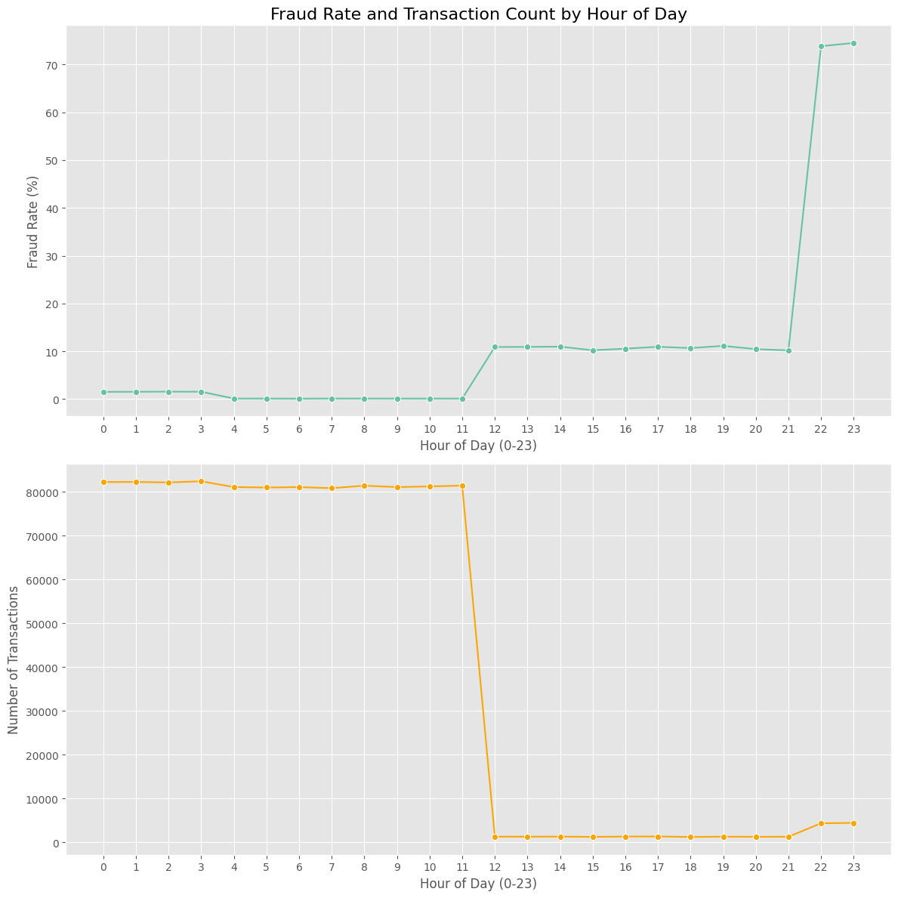
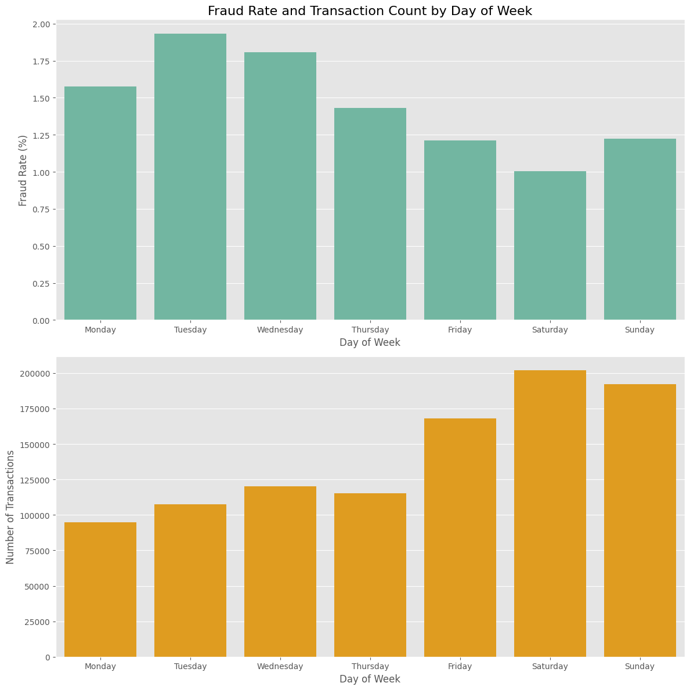

# **初期データセットに関する探索的データ分析（EDA）レポート**

## 1. はじめに

本レポートは、`Sparkov_Data_Generation`スクリプトを用いて生成し、PostgreSQLに格納したクレジットカード取引データ（顧客5000人分）に対する初期的な探索的データ分析の結果を要約するものである。分析には、対象データから抽出した10万件のトランザクションサンプルを使用した。目的は、データセットの基本的な特性を把握し、不正検知モデル構築に向けた有益な洞察を得ることである。

## 2. データ概要

分析対象のデータは、26の顧客属性および取引情報に関するカラムで構成されている。データセットの最も顕著な特徴は、クラスの不均衡性である。

* 本データセットは著しく不均衡である。不正利用（`is_fraud=1`）の割合は、分析サンプルにおいて約**1.38%**であった。
* この不均衡性は、今後のモデル評価において、単純な正解率（Accuracy）ではなく、適合率（Precision）や再現率（Recall）、F1スコアといった指標を重視する必要があることを示唆している。

## 3. 主要な分析結果

### 3.1. 取引金額 (`amt`) に関する分析

取引金額は、正常な取引と不正利用とで、その分布が大きく異なることが確認された。

* 正常取引（`is_fraud=0`）の金額は、中央値（50%点）が**$61.27**と少額決済に集中している。しかし、最大値は$17,635に達しており、高額な外れ値も多数存在する。
* 一方、不正取引（`is_fraud=1`）の金額は、中央値が**$399.13**と、正常取引の6倍以上であり、全体的に高額である。また、金額のばらつきも大きい（箱ひげ図の箱の高さが広い）。
* この結果から、取引金額`amt`は不正検知において極めて強力な特徴量になることが期待される。

### 3.2. 取引カテゴリ (`category`) に関する分析

取引カテゴリと不正利用の関係をクロス集計した結果、特定のカテゴリが不正と強く関連していることが判明した。

* `entertainment`, `shopping_net`, `health_fitness`など、複数のカテゴリにおいては、分析サンプル内で正常な取引が**0件**であり、「不正専用」のカテゴリとして観測された。
* これは、データ生成ロジックが、不正プロファイルに対して特定のカテゴリでの取引を集中させている結果である。
* 一方で、`misc_pos`や`gas_transport`のように、正常と不正の両方の取引が含まれるカテゴリも存在し、不正のロジックが単純なカテゴリ分けではないことも確認された。

### 3.3. 時系列に関する分析

取引が発生した曜日および時間帯と、不正利用率との間には、明確なパターンが観測された。

* 取引件数と不正率は、曜日・時間帯ともに**明確な逆相関**の関係にあることが確認された。
* **曜日別**: 取引件数が多い週末（土日）は不正率が低く、件数が少ない週半ば（火曜・水曜）に不正率のピークが見られた。
* **時間帯別**: 取引件数が非常に多い深夜〜午前中（0-11時）の不正率はほぼ0%であるのに対し、取引が閑散となる正午以降に不正率は上昇し、特に22時台に急騰するパターンが観測された。

## 4. 結論と今後の展望

今回のEDAを通じて、本データセットは「**クラスの不均衡性**」「**金額やカテゴリによる不正パターンの明確な分離**」「**取引時間帯における逆相関の傾向**」という3つの大きな特徴を持つことが明らかになった。

これらの洞察は、次期スプリントで計画している「特徴量エンジニアリング」において、極めて重要な指針となる。具体的には、以下の特徴量の作成が有効であると考えられる。

* 取引金額`amt`そのもの、および関連する統計量
* 取引カテゴリ`category`をモデルが扱える形式（例：One-Hotエンコーディング）に変換したもの
* `hour`や`day_of_week`といった時間に関する特徴量
* 顧客の居住地と加盟店の座標から算出される`距離`
* 顧客ごとの取引間隔時間