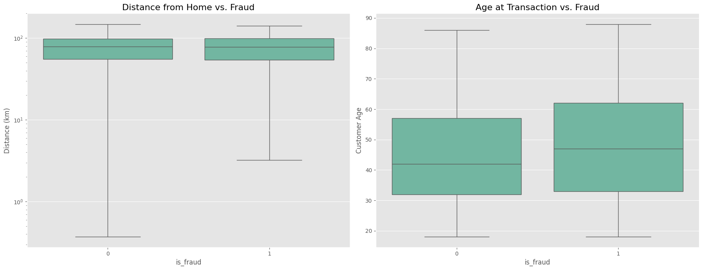
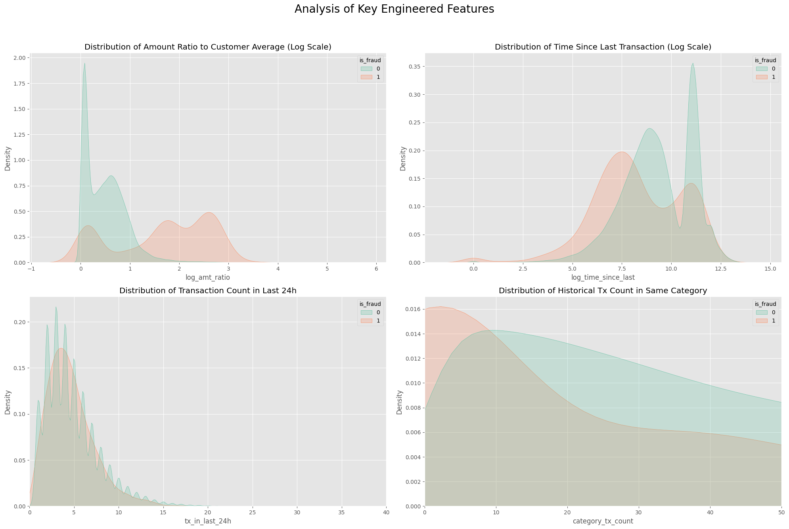

# **特徴量エンジニアリングとEDA**

## 1. 概要

Sprint 1で準備した基礎データテーブルを元に、不正検知モデルの予測性能を向上させるための「特徴量エンジニアリング」を実施し、その有効性を探索的データ分析（EDA）によって検証すること。

実装においては、PostgreSQLのウィンドウ関数を駆使し、データベース内で効率的に計算を実行するアプローチを採用した。また、開発プロセスにおいては、まずJupyter Notebookで少量データを用いてロジックを実験・検証し、その後、再利用可能なPythonスクリプトおよびSQLファイルに落とし込むという、堅牢な手法で進めた。

結果として、不正検知に有効と考えられる複数の特徴量グループ（Recency, Frequency, Monetary, 顧客行動逸脱度など）の設計と実装を完了し、それらが不正取引と正常取引を区別する上で強力なシグナルを持つことをEDAによって確認した。

## 2. 実装した特徴量エンジニアリング

`transactions`テーブルの元データから、以下の特徴量を新たに算出し、`feature_transactions`テーブルとして構築するパイプラインを設計・実装した。

* **基本特徴量**:
    * `trans_ts`: `text`型の`trans_date`と`trans_time`を結合し、`timestamp`型に変換した列。全ての時間基準の計算で利用される。
    * `age_at_tx`: `dob`と`trans_ts`から算出した、取引発生時点での顧客の年齢。
    * `distance_from_home_km`: 顧客の自宅座標と加盟店の座標から算出した、取引地点までの球面距離(km)。

* **RFMに基づく時系列特徴量**:
    * `time_since_last_tx_sec` (Recency): 同一顧客の直前の取引からの経過時間（秒）。
    * `tx_in_last_...` (Frequency/Velocity): 現在の取引から遡り、過去1時間/6時間/24時間/7日間における取引回数。
    * `avg_amt_last_...` (Monetary): 過去24時間/7日間の平均取引金額。

* **顧客の行動逸脱を測る特徴量**:
    * `avg_amt_historical`: 現在の取引を含まない、その顧客の過去の全取引における平均取引金額。
    * `amt_ratio_to_avg`: 現在の取引金額が、その顧客の過去の平均額と比べて何倍かを示す比率。

* **カテゴリ・加盟店に特化した特徴量**:
    * `category_tx_count`: その顧客が、その取引カテゴリを過去に何回利用したか。
    * `tx_with_same_merchant_last_1h`: 同一加盟店における、過去1時間の連続利用回数。

## 3. 特徴量評価のためのEDA結果

上記で設計した特徴量の分布を、不正利用の有無で比較・可視化した結果、多くの特徴量が不正検知に極めて有効であることが示唆された。

* **金額逸脱度 (`amt_ratio_to_avg`)**: 不正取引と正常取引の分布がほぼ完全に分離しており、極めて強力な予測性能を持つことが確認された。
* **時間的特徴**: 「直前の取引からの経過時間」は不正取引の方が短く、「単位時間あたりの取引回数」は不正取引の方が多いという、典型的な不正パターンをデータから確認できた。また、分布が二峰性を示しており、複数の行動パターンがデータ内に混在している可能性が示唆された。
* **行動履歴特徴**: 「同一カテゴリでの過去の取引回数」は、不正取引において`0`（＝初めて利用するカテゴリ）に強く集中しており、「馴染みのないカテゴリでの取引」が不正の兆候となりうることを裏付けた。

